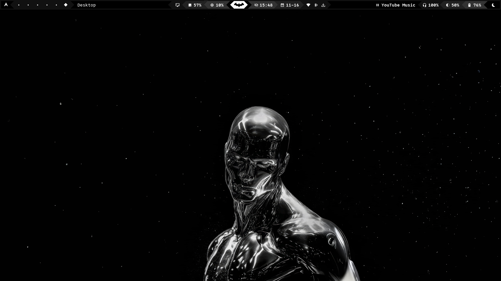
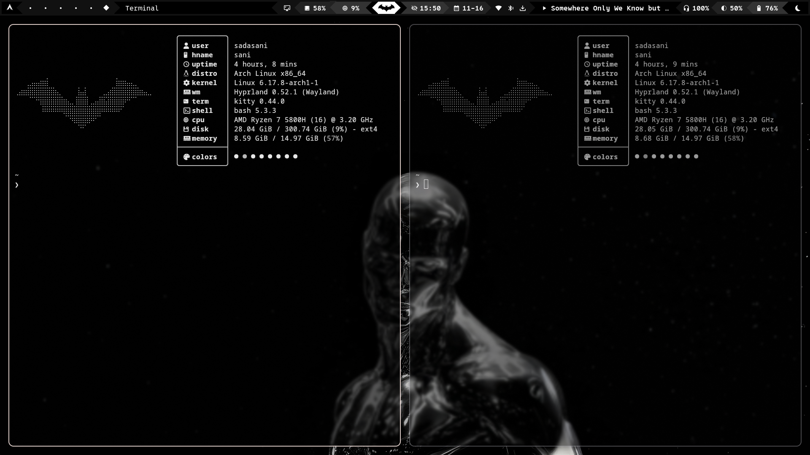

# Arch Hyprland + Waybar Setup

Personal dotfiles for my Arch Linux Hyprland desktop environment.

## Screenshot





## What's Included

### Window Manager & Compositor
- **Hyprland** (`hypr/`) - Wayland compositor with animations and custom keybinds
  - `hyprland.conf` - Main configuration
  - `hypridle.conf` - Idle management
  - `hyprlock.conf` - Lock screen settings
  - `hyprpaper.conf` - Wallpaper daemon config
  - `conf/` - Modular config snippets
  - `scripts/` - Helper scripts for automation

### Status Bar
- **Waybar** (`waybar/`) - Highly customizable status bar
  - Inspired by [mechabar](https://github.com/sejjy/mechabar)
  - Custom modules and styling
  - `waybar.bak` - Backup configurations

### Terminal & Shell
- **Kitty** (`kitty/`) - GPU-accelerated terminal emulator
  - Custom color schemes with matugen integration
- **Fish** (`fish/`) - Friendly interactive shell
- **Zsh** (`zshrc`) - Alternative shell configuration
- **Bash** (`bashrc`) - Bash configuration

### Theme & Appearance
- **Matugen** (`matugen/`) - Material You color generation
  - Templates for consistent theming across apps
- **GTK** (`gtk-3.0/`, `gtk-4.0/`) - GTK theme configurations
  - Custom `colors.css` and styling
- **Qt6ct** (`qt6ct/`) - Qt6 configuration tool settings

### Additional Tools
- **Rofi** (`rofi/`) - Application launcher and window switcher
- **Swaync** (`swaync/`) - Notification daemon for Wayland
- **Wlogout** (`wlogout/`) - Logout menu with Wayland support
- **Walker** (`walker/`) - Additional launcher/runner
- **Btop** (`btop/`) - Resource monitor with custom themes
- **Cava** (`cava/`) - Console audio visualizer
- **Nvim** (`nvim/`) - Neovim configuration
- **Fastfetch** (`fastfetch`) - System info fetch tool
- **Waypaper** (`waypaper/`) - Wallpaper management

### System Integration
- **ML4W** (`ml4w/`, `com.ml4w.hyprlandsettings/`) - Hyprland settings GUI
- **Touchegg** (`touchegg/`) - Multi-touch gesture recognizer
- **Oh My Posh** (`ohmyposh/`) - Cross-shell prompt theme engine

## Installation

1. **Backup your current configs:**
   ```bash
   cp -r ~/.config ~/.config.backup
   ```

2. **Clone and copy these dotfiles:**
   ```bash
   git clone https://github.com/umersanii/dotfiles.git
   cp -r dotfiles/* ~/.config/
   ```

3. **Install dependencies** (adjust for your package manager):
   ```bash
   # Core
   sudo pacman -S hyprland waybar kitty rofi swaync
   
   # Additional tools
   sudo pacman -S btop cava neovim fastfetch
   
   # Theme tools
   yay -S matugen waypaper wlogout
   ```

4. **Adjust device-specific settings:**
   - Monitor configurations in `hypr/hyprland.conf`
   - Input devices (keyboard, mouse, touchpad)
   - GPU-specific settings if needed

5. **Reload/restart:**
   ```bash
   # Restart Hyprland (or re-login)
   hyprctl reload
   
   # Restart Waybar
   killall waybar && waybar &
   ```

## Customization

- **Colors**: Modify `matugen/` templates to change the overall color scheme
- **Keybinds**: Edit `hypr/hyprland.conf` for custom shortcuts
- **Waybar modules**: Customize modules in `waybar/config` and styling in `waybar/style.css`
- **Wallpapers**: Use `waypaper` or configure `hypr/hyprpaper.conf`

## Credits & Inspiration

- **Waybar design**: Inspired by [sejjy/mechabar](https://github.com/sejjy/mechabar)
- **Hyprland setup**: Based on [mylinuxforwork/dotfiles](https://github.com/mylinuxforwork/dotfiles)

## Notes

- These configs are tailored to my hardware and workflow - adjust as needed
- Some configs may reference specific paths or devices - update accordingly
- Check individual config files for additional documentation
